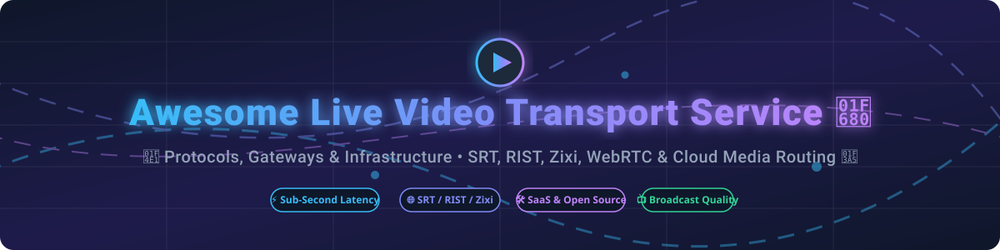

  

# 📡 Awesome Live Video Transport Service 🎥

  
  
  
  
  
  

## 🚀 Top Live Video Transport Service Ecosystem & Infrastructure

**A curated list of commercial SaaS products & open-source GitHub projects for ultra-low latency live video contribution, reliable stream routing, SRT/RIST media gateways, and broadcast IP transport.** 🌐📡

📅 **Last updated: October 2026**

---

### 🔍 Overview & Market Insight

This repository tracks notable **commercial live video transport platforms** and **open-source projects** that reliably move broadcast-quality video over unmanaged IP networks — from field contribution feeds and remote broadcast production (REMI) to cloud media routing and multi-point distribution without packet loss or latency degradation.

> 💡 **Market Size & Industry Dynamics**:  
> The global live video transport & contribution market is estimated at **$2.5 Billion to $3.8 Billion USD** (growing at a ~14% CAGR driven by IP transformation, REMI remote production, and cloud broadcasting). The market is **moderately fragmented** with major enterprise cloud hyper-scalers (e.g. AWS Elemental MediaConnect) and broadcast infrastructure leaders (Zixi, Haivision, LiveU, Grass Valley, Synamedia) dominating high-reliability tier-1 broadcast feeds, while a vibrant open-source ecosystem (SRT Alliance, libRIST, SRS, MediaMTX) empowers self-hosted media gateways and low-cost field contribution.

---

## 📑 Table of Contents
- [🏢 SaaS/Hosted Platforms](#-saashosted-platforms)
- [💻 Open-Source GitHub Projects](#-open-source-github-projects)
- [🤝 How to Contribute](#-how-to-contribute)
- [💖 Support & Sponsorship](#-support--sponsorship)
- [⭐ Star History](#-star-history)
- [⚠️ Disclaimer](#-disclaimer)

---

## 🏢 SaaS/Hosted Platforms

> 📊 **Market Structure**: Moderately fragmented enterprise sector. Sorted by **Company Scale / Revenue** (descending).

| 🏢 Platform | 💰 Company Scale (Revenue / Valuation) | 💵 Starting Pricing | 🎁 Free Tier / Trial Limit | 📝 Description & Key Features |
| :--- | :--- | :--- | :--- | :--- |
| **[AWS Elemental MediaConnect](https://aws.amazon.com/mediaconnect/)** | **$108B/yr** (AWS Division Revenue; Amazon Market Cap $2.3T) | **$0.16/hr** per running flow + data transfer fees | **No free tier** (Pay-as-you-go, no charge when flows are stopped/idle) | ☁️ AWS's managed live video transport service supporting RIST, SRT, Zixi, RTP, and CDI protocols. Best for AWS-native live video contribution. |
| **[Grass Valley AMPP](https://www.grassvalley.com/)** | **~$545M/yr** (Revenue estimate; $220M strategic refinancing in 2024) | Custom enterprise quote / Pay-as-you-go microservices | **Sales demo request required** (No public self-serve free trial) | 🎥 Cloud-native media production platform providing live contribution and remote production workflows. Best for cloud-based production. |
| **[Synamedia Video Network](https://www.synamedia.com/)** | **~$350M–$500M/yr** (Revenue estimate; Permira & Sky backed) | Custom enterprise licensing & subscription terms | **Sales demo request required** (No public self-serve free trial) | 📺 Video network solutions for contribution, distribution, and edge processing. Best for pay-TV and broadcast operators. |
| **[Red Bee Media](https://www.redbeemedia.com/)** | **~$440M/yr** (Wholly owned subsidiary of Ericsson, Market Cap ~$20B+) | Managed services contract / Custom SLA pricing | **Sales consultation required** (No public self-serve free trial) | 🛰️ Broadcast managed services covering contribution, distribution, and media management. Best for managed broadcast services. |
| **[LiveU Cloud](https://www.liveu.tv/)** | **>$400M** Valuation ($100M–$150M/yr Revenue; Carlyle Group owned) | **$29/month** (LiveU Go Starter tier) | **14-day free trial** for LiveU Studio (or 3-day trial for LiveU Go app) | 📶 Cloud-based live video contribution with cellular bonding and remote production. Best for field contribution and newsgathering. |
| **[Haivision SRT Gateway](https://www.haivision.com/)** | **~CA$142M/yr** Revenue (~CA$105M Market Cap, TSX: HAI) | Custom software/hardware quote (Free Haivision Play Pro app available) | **Free software trial upon request** (Haivision Hub 360 / AWS Marketplace trial) | ⚡ Commercial SRT routing and gateway; reference implementation by original developers of SRT. Best for SRT-native workflows. |
| **[LTN Global](https://ltnglobal.com/)** | **~$50M–$150M/yr** (Revenue estimate; Private equity backed) | Custom SLA & managed network service tiering | **Sales demo request required** (No public self-serve free trial) | 🌍 Managed IP video transport delivering reliable contribution and distribution for broadcasters. Best for global broadcast transport. |
| **[TVU Networks](https://www.tvunetworks.com/)** | **~$50M–$100M/yr** (Revenue estimate; Private entity) | **~18€/hr** (TVU Producer) / **$29/month** (TVU Go Starter) | **3-day free trial** (TVU Go app) or pay-per-use hardware options | 📡 Live video transmission and remote production utilizing cellular bonding and cloud workflows. Best for newsgathering and live events. |
| **[Zixi Cloud](https://zixi.com/)** | **~$20M–$50M/yr** (Acquired by Clearhaven Partners in 2024) | Custom ZaaS (Zixi-as-a-Service) / AWS Marketplace PAYG | **Free demo / trial upon request** (or 50 GB free trial via partner Red5 Cloud) | 🛡️ Pioneer of reliable internet transport with content-aware FEC, ARQ, and hitless redundancy across 10,000+ channels. Best for enterprise broadcast contribution. |
| **[VideoFlow](https://www.videoflow.tv/)** | **~$10M–$20M/yr** (Revenue estimate; Private entity) | Custom DVP software license & gateway pricing | **Free demo request required** (No public self-serve free trial) | 🔄 Reliable video transport with adaptive rate control (waived ARQ patent for RIST standard). Best for broadcast-grade reliability. |

---

## 💻 Open-Source GitHub Projects

> 🌟 **Sorted by GitHub_Stars_Count** (descending). Each Stars_Badge links directly to the repo's stargazers page.

- **[FFmpeg](https://github.com/FFmpeg/FFmpeg)**   
  ⚡ **The universal multimedia framework**, LGPL/GPL licensed. Decodes, encodes, transmuxes, and transports live SRT, RIST, RTP, RTMP, and UDP video streams across all major platforms. **Best for core pipeline processing and transmuxing.**

- **[SRS (Simple Realtime Server)](https://github.com/ossrs/srs)**   
  🚀 **Industrial-strength live streaming server**, MIT/MulanPSL-2.0 licensed (**29,206+ stars**). High-performance RTMP, WebRTC, HLS, HTTP-FLV, SRT, and MPEG-DASH origin server with sub-second latency capability. **Best for production live streaming and relay.**

- **[GStreamer](https://github.com/GStreamer/gstreamer)**   
  🧩 **Flexible pipeline-based multimedia framework**, LGPL licensed (**15,400+ stars**). Underpins broadcast production software with native GStreamer elements for SRT (`srtsink`/`srtsrc`), RIST, RTP, WebRTC, and NDI. **Best for custom media transport pipelines.**

- **[MediaMTX](https://github.com/bluenviron/mediamtx)**   
  📦 **Zero-dependency multi-protocol live media server**, MIT licensed (**14,500+ stars**). Supports Media-over-QUIC, SRT, WebRTC, RTSP, RTMP, LL-HLS, MPEG-TS, and RTP with zero external dependencies and automatic protocol conversion. **Best for edge deployments & simple media routing.**

- **[Janus WebRTC Server](https://github.com/meetecho/janus-gateway)**   
  🌐 **General-purpose WebRTC gateway**, GPL-3.0 licensed (**9,159+ stars**). Modular C gateway with plugins for WebRTC streaming, SIP signaling, and RTP bridging. **Best for WebRTC-to-legacy broadcast bridging.**

- **[ZLMediaKit](https://github.com/ZLMediaKit/ZLMediaKit)**   
  ⚡ **High-performance C++11 media server**, MIT licensed (**8,400+ stars**). Supports RTSP, RTMP, HLS, HTTP-FLV, WebRTC, SRT, and GB28181 with low CPU footprint and multi-thread optimization. **Best for high-concurrency low-latency media routing.**

- **[coturn](https://github.com/coturn/coturn)**   
  🔒 **Free open-source implementation of TURN and STUN Server**, BSD-3-Clause licensed (**8,200+ stars**). Essential VoIP and WebRTC media traffic relay for NAT and firewall traversal across unmanaged networks. **Best for WebRTC NAT traversal.**

- **[SRT (Secure Reliable Transport)](https://github.com/Haivision/srt)**   
  🛡️ **Open-source video transport protocol reference implementation**, MPL-2.0 licensed (**2,700+ stars**). ARQ packet recovery, AES 128/256 encryption, and firewall traversal developed by Haivision & SRT Alliance. **Best for low-latency contribution over lossy IP networks.**

- **[Project-Lightspeed](https://github.com/GRVYDEV/Project-Lightspeed)**   
  ⏱️ **Sub-second WebRTC live streaming stack**, GPL-3.0 licensed (**1,400+ stars**). Ingests broadcast streams from OBS via FTL/RTMP and relays sub-second video directly to web browsers. **Best for real-time interactive streaming.**

- **[Restreamer](https://github.com/datarhei/restreamer)**   
  📡 **Self-hosted live video streaming app**, Apache-2.0 licensed (**1,200+ stars**). Easy UI for receiving live SRT, RTMP, or RTSP feeds and multi-publishing to YouTube, Twitch, and custom CDN endpoints. **Best for self-hosted stream multi-publishing.**

- **[HydraSRT](https://github.com/streamband/hydra-srt)**   
  🔀 **Open-source alternative to Haivision SRT Gateway**, Apache-2.0 licensed. Built with Elixir/OTP + Rust + GStreamer. Features automatic source failover, stream authentication, and Prometheus/VictoriaMetrics telemetry. **Best for open-source SRT gateway routing.**

- **[IRLServer / OBS-IRL Tooling](https://github.com/irlserver/obs-irl-source)**   
  🎛️ **Suite of open-source tools for IRL streaming with SRTLA bonding**, AGPL-3.0/MIT/MPL-2.0 licensed. Ingests SRT/RIST feeds into OBS, with `srtla_send` aggregating bandwidth across multiple cellular paths. **Best for mobile field bonding contribution.**

- **[ts-transformer](https://github.com/aklofas/ts-transformer)**   
  📡 **Streams H.264/H.265 video with typed KLV metadata over SRT/RIST/RTP**, open-source. Rust core with MISB ST 0601/0102/0605/0903 metadata decoding and transmuxing. **Best for defense, drone, and sensor video transport.**

- **[eturnal](https://github.com/processone/eturnal)**   
  🛡️ **Modern, scalable STUN/TURN server**, Apache-2.0 licensed. Written in Erlang for high-concurrency NAT traversal and media relaying. **Best for modern enterprise WebRTC deployments.**

---

## 🤝 How to Contribute

Contributions are warmly welcome! Please follow these steps to add new SaaS platforms or open-source projects:

1. 🍴 **Fork** the repository.
2. 📝 **Add/edit** entries in `README.md` maintaining table/formatting consistency.
3. 🔗 **Include**: Name, official site link, GitHub_Stars_Badge (if open-source), 1–2 sentence factual summary, and key target use-case.
4. 📬 **Submit a PR** with a brief summary of the changes.

---

## 💖 Support & Sponsorship

If this curated list helps your engineering workflow, broadcast deployment, or research, consider supporting the project!

- ⭐ **Star** this repository to show your appreciation!
- 🔀 **Fork** and share it with broadcast engineers & media developers.
- ☕ **Sponsor / Buy Me a Coffee**: Support ongoing open-source maintenance via [GitHub Sponsors](https://github.com/sponsors/ishandutta2007).

Thank you for building a more open, resilient, and transparent live video transport ecosystem! ❤️

---

## ⭐ Star History

---

## ⚠️ Disclaimer

- This repository is a **community-curated index** for informational purposes and does not constitute an endorsement.
- Live video transport processes broadcast-quality media and requires proper security hardening, network bandwidth planning, and regulatory compliance.
- **Protocol Guidance**: Choose **SRT** for low-latency ARQ contribution with AES encryption; **RIST** for vendor-neutral interoperability with SMPTE 2022-1 FEC & bonding; **Zixi** for managed content-aware optimization with hitless redundancy.
- Always review open-source licenses (MPL-2.0, Apache-2.0, GPL-3.0, MIT, BSD) prior to commercial deployment.

---

  <b>Made with ❤️ for broadcast engineers, live streaming developers, and media specialists worldwide.</b>

